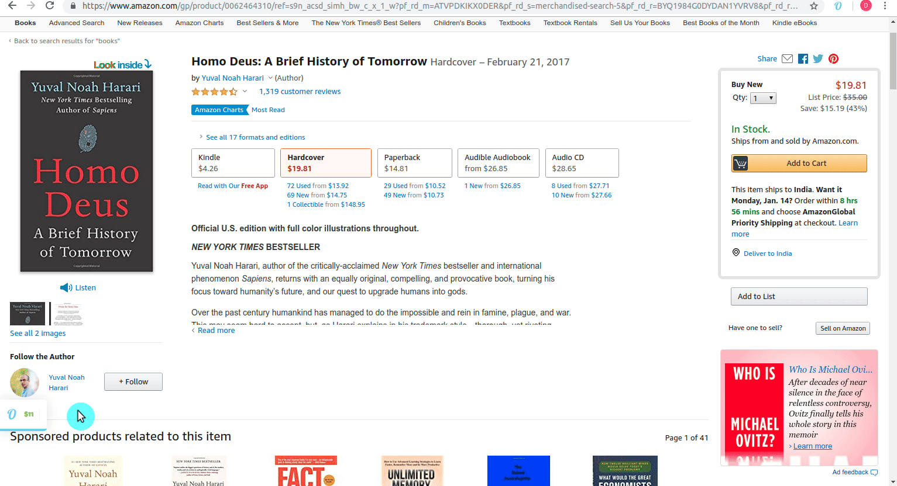
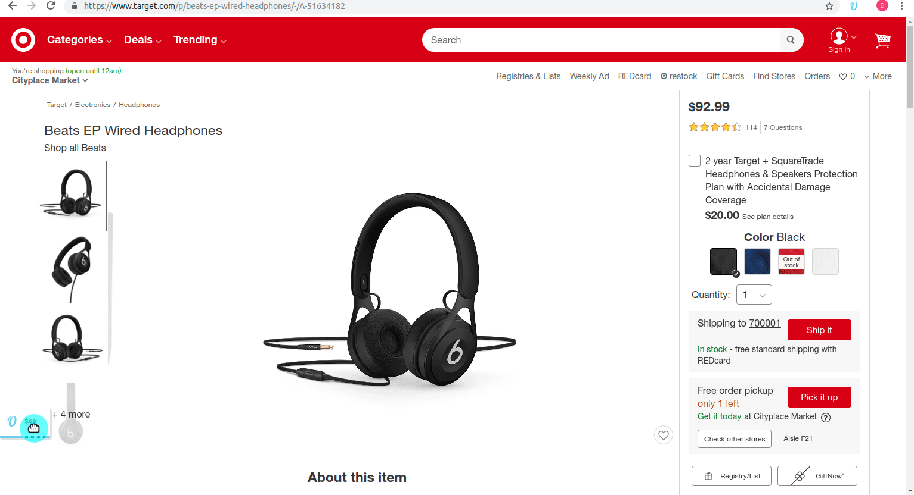

# OPSOPI

Opsopi is an open source price comparison extension for google chrome, it helps to compare the price of a product across many e-commerce websites.
  
# How to use OPSOPI

### Find low prices without doing anything
- OPSOPI will appear on product pages
- Click on the OPSOPI to see price of the product in other sites
- Click on a result to go to the product page on other sites



<br/>
<br/>
<hr/>
<br/>
<br/>




OPSOPI works on the following sites by default
- [amazon.com](https://www.amazon.com)
- [bestbuy.com](https://www.bestbuy.com)
- [costco.com](https://www.costco.com)
- [ebay.com](https://www.ebay.com/)
- [jet.com](https://jet.com/)
- [newegg.com](https://www.newegg.com)
- [overstock.com](https://www.overstock.com)
- [target.com](https://www.target.com)
- [walmart.com](https://www.walmart.com)
- [abebooks.com](https://www.abebooks.com)
- [alibris.com](https://www.alibris.com)
- [barnesandnoble.com](https://www.barnesandnoble.com/)
- [strandbooks.com](https://www.strandbooks.com/)
- [thriftbooks.com](https://www.thriftbooks.com/)

### Extending OPSOPI
Apart from the sites OPSOPI works by default, users can make it to work on whatever sites they want.


  ### Adding more sites:
Opsopi works on all major sites if you want to make opsopi to work on a site you can do by adding
custom javascript to the extension 

##### Adding new sites using Javascipt:

- Click on the opsopi icon on the browser bar
- Click settings button in the popup
- Click Manage sites button in the settings page
- Give the url of the site you want to add press "Add site" button
- Click the "I will give my Javascript File" button and follow the walk through
 
opsopi requires two javascript files for each site you want to add
- backsearch script
- product page script

#### backsearch script
This script will be executed on every product page, this script has to fetch price of the product from the site(site intended to add) and give it a call back so that the price will be displayed.
This script will have access to the following:
- prod_title (variable representing the title of the product in the productpage)
- website (Hostname of the produc page)
- success_call_back (function for the script to call when it successfully obtain results)
- success_call_back accepts prod_link,title,prod_price,website,img_src as arguments
- fail_call_back (function the script has to be called when something goes wrong)
-this script has access to jquery 

#### product page script
This script will be executed on every page of the site you want to add, this script has to extract the product details and call a function so that opsopi will get the price of the product from other sites and display

This script will have access to the following:
- page_html (html string of the page)
- website (hostname of the website)
- success_call_back (function the script has to call so that opsopi will get price of the product from other sites and display)
- fail_call_back (function the script has to be called when something goes wrong)
-this script has access to jquery 

#### Example adding script
The following scripts is used to add https://www.shop.com

###### example backsearch script
```
 // This script will have access to the following
 // prod_title (title of the product)
 // website (website name)
 // success_call_back (call back to pass the found result)
 // success_call_back accepts prod_link,title,prod_price,website,img_src of the found product
 // fail_call_back ()
// jquery

 var req = $.ajax({
 	"type": "Get",
 	"url":"https://www.shop.com/search/"+encodeURI(prod_title).replace(/%20/g,"+")
 });

 req.done(function(response){
 	var resp_elem = $('<div/>').append($.parseHTML(response));
 	var first_result = "";
 	var product_title = "";
 	var product_link = "";
 	var product_price = "";
 	var product_img_src = "";
 	if($(resp_elem).find(".qa-search-products-results li").length>0){
 		first_result = $(resp_elem).find(".qa-search-products-results li")[0];

	 	if($(first_result).find(".product-results__prod-title-m").length>0){
	 		product_title = $(first_result).find(".product-results__prod-title-m").text();
	 	}

	 	if($(first_result).find(".qa-search-product-title-link").length>0){
	 		product_link = $(first_result).find(".qa-search-product-title-link").attr("href");
	 	}
	 	if($(first_result).find(".product-results__final-price-m").length>0){
	 		product_price = $(first_result).find(".product-results__final-price-m").text().replace(/[$,]/g,"");
	 	}
	 	if($(first_result).find(".product-results__prod-image-m").length>0){
	 		product_img_src = $(first_result).find(".product-results__prod-image-m").attr("src");
	 	}

	 	if(product_title && product_link && product_price && product_img_src){
	 		success_call_back(product_link,product_title,product_price,"shop.com",product_img_src);
	 	}else{
	 		fail_call_back();
	 	}

 	}else{
 		fail_call_back();
 	}

 });

 req.fail(function(){
 	fail_call_back();
 });
```

###### Example product page script

```
 // This script will have access to the following
 // page_html (html of the product page)
 // website (website name)
 // success_call_back (callback to call when details are extracted from the product page)
 // success_call_back accepts the following arguments title,prod_price,img_src,website
 // fail_call_back

var html_elem = $('<div/>').append($.parseHTML(page_html));

var title = "";
var prod_price = "";
var img_src = "";


if($(html_elem).find("#product").length>0){
	if($(html_elem).find(".product__title:eq(0)").length>0){
		title = $(html_elem).find(".product__title:eq(0)").text();
	}
	if($(html_elem).find("#product-price").length>0){
		prod_price = $(html_elem).find("#product-price").text().replace(/[$,]/g,"");
	}
	if($(html_elem).find(".product__image").length>0){
		img_src = $(html_elem).find(".product__image").attr("src");
	}

	if(title && prod_price && img_src){
		success_call_back(title,prod_price,img_src,"shop.com");
	}else{
		fail_call_back();	
	}
	

}else{
	fail_call_back();
}
```
#### Adding site without using javascript
This needs improvement as it fails often
- Click on the opsopi icon on the browser bar
- Click settings button in the popup
- Click Manage sites button in the settings page
- Give the url of the site you want to add press "Add site" button
- Click the "Guide me to add this site" and follow the walk through

#### Requesting others to add site
- Click on the opsopi icon on the browser bar
- Click on "Ask to add site" button
- we will add this site and push an update (sites with most requests will be given priority)
- people can track the number of requests to add sites on https://opsopi.appspot.com/requested

### Helping OPSOPI
- You can help opsopi by solving issues https://github.com/durairajaa/opsopi/issues
- You can add more sites to opsopi
